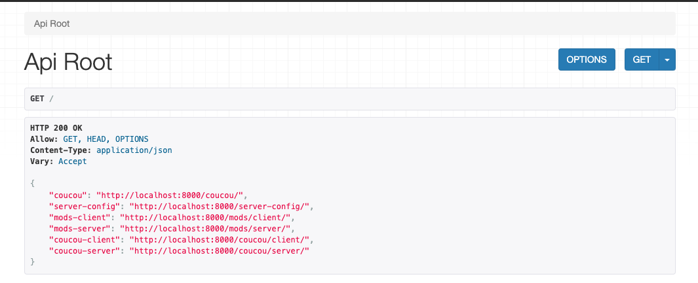
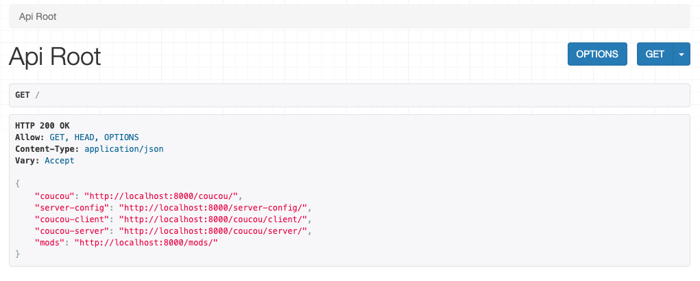
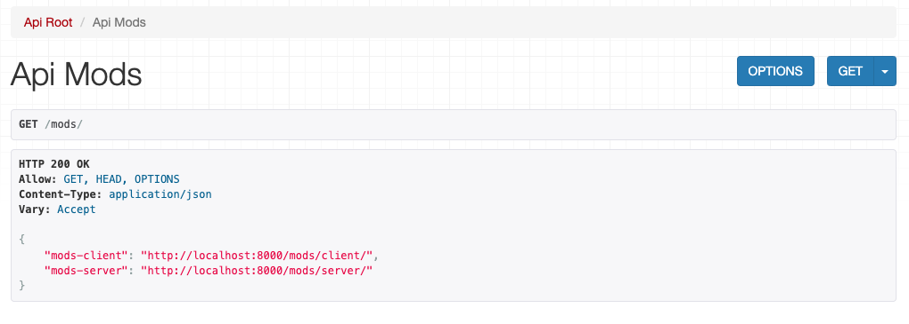

[](https://codecov.io/github/enzofrnt/djangorestframework-hybridrouter)

# djangorestframework-hybridrouter
A router for ViewSets and Views! And with a better browsable API!

***Inspired by [this topic](https://stackoverflow.com/questions/18817988/using-django-rest-frameworks-browsable-api-with-apiviews/78459183#78459183).***

## Overview

The `HybridRouter` class is an extension of Django REST framework's `DefaultRouter` that allows you to register both ViewSets and APIViews. This provides more flexibility in managing your URL routes and offers a better browsable API experience.

## Features

- Register both ViewSets and APIViews.
- Simplified URL patterns for better readability.
- Enhanced browsable API with custom intermediary API views for grouped endpoints ***Checkout the experimental features section for more details***.

## Installation

```bash
pip install djangorestframework-hybridrouter
```

## Usage

Here’s an example of how to use the HybridRouter:
```python
class ServerConfigViewSet(ViewSet):
    def list(self, request):
        return Response({'a': 'b'})

class ServerConfigView(APIView):
    def get(self, request):
        return Response({'config': 'server'})

class ClientModsView(APIView):
    def get(self, request):
        return Response({'mods': 'client'})

class ServerModsView(APIView):
    def get(self, request):
        return Response({'mods': 'server'})

router = HybridRouter(enable_intermediate_apiviews=True)
router.register_view(r'^server-config/$', ServerConfigView, name='server-config')
router.register_view(r'^mods/client/$', ClientModsView, name='mods-client')
router.register_view(r'^mods/server/$', ServerModsView, name='mods-server')
router.register_viewset(r'coucou', ServerConfigViewSet, basename='coucou')
router.register_view(r'^coucou/client/$', ClientModsView, name='coucou-client')
router.register_view(r'^coucou/server/$', ServerModsView, name='coucou-server')

urlpatterns = [
    path('', include(router.urls)),
]
```

## Documentation

HybridRouter

- `register_view(url, view, name)`

    Registers an APIView with the specified URL pattern.

        •	url: URL pattern for the view.
        •	view: The APIView class.
        •	name: The name of the view.

- `register_viewset(prefix, viewset, basename=None)`

    Registers a ViewSet with the specified prefix.

        •	prefix: URL prefix for the viewset.
        •	viewset: The ViewSet class.
        •	basename: The base name for the viewset (optional).

- `register(prefix, view, name)`

    Registers an APIView or ViewSet with the specified prefix.

        •	prefix: URL prefix for the view.
        •	view: The APIView or ViewSet class.
        •	name: The name of the view.

## Advanced Features

Custom Intermediary API Views

The HybridRouter automatically creates custom intermediary API views for grouped endpoints. This is useful for organizing your API and providing a cleaner browsable interface.

## Experimental Features

In these improved Django REST framework's router, I introduced a new feature that automatically creates intermediary API views for grouped endpoints. This feature is still in development and may not work as expected. Please report any issues or suggestions.

here is a quick example of how to use this feature:

```python
router = HybridRouter(enable_intermediate_apiviews=False)

router.register_view(r'^server-config', ServerConfigView, name='server-config')
router.register_view(r'^mods/client', ClientModsView, name='mods-client')
router.register_view(r'^mods/server', ServerModsView, name='mods-server')
router.register_view(r'^coucou/client', ClientModsView, name='coucou-client')
router.register_view(r'^coucou/server', ServerModsView, name='coucou-server')
router.register_viewset(r'coucou', ServerConfigViewSet, basename='coucou')
```

With this configuration of the router with `enable_intermediate_apiviews`set to `False`, the intermediary API views will not be created. So the browsable API will look like on a `DefaultRouter` :



But if you set `enable_intermediate_apiviews` to `True`, the intermediary API views will be created and the browsable API will look like this:

```python
router = HybridRouter(enable_intermediate_apiviews=True)
```




This improves the readability and the logic of the browsable API and provides a better user experience. 

And as you can see that will not interfere with other already existing views. **Here, the `ServerConfigViewSet` is still accessible through the `coucou` endpoint and as not been overridden by an intermediary API view.**

***Note: Spectacular is supported and the intermediary API views will be generated with the `@extend_schema(exclude=True)` decorator, to not be included in the OpenAPI schema.***